# Aave V1 完整技术文档

## 概述

Aave V1 是一个去中心化借贷协议，允许用户存入资产获得利息，或使用资产作为抵押品借入其他资产。该协议的核心创新包括：

- **aToken机制**：存款时铸造利息代币，实现利息的实时累积
- **双利率模式**：支持稳定利率和浮动利率借贷
- **闪电贷功能**：无需抵押的即时借贷
- **清算机制**：自动化的风险管理系统

## 系统架构

### 核心组件

Aave V1 采用模块化设计，主要包含以下核心组件：

1. **LendingPool** - 主借贷池合约，处理所有用户操作
2. **LendingPoolCore** - 核心状态管理，存储协议数据
3. **LendingPoolDataProvider** - 数据提供者，提供查询接口
4. **LendingPoolLiquidationManager** - 清算管理，处理清算逻辑
5. **LendingPoolConfigurator** - 配置管理，管理协议参数
6. **LendingPoolAddressesProvider** - 地址注册中心，管理合约地址
7. **AToken** - 利息代币，代表用户存款份额
8. **Price Oracle** - 价格预言机，提供资产价格
9. **Lending Rate Oracle** - 借贷利率预言机，提供利率信息
10. **Interest Rate Strategy** - 利率策略，计算动态利率

### 架构特点

- **模块化设计**：各组件职责明确，便于维护和升级
- **状态分离**：核心状态管理与业务逻辑分离
- **权限控制**：严格的权限管理机制
- **安全优先**：多重安全检查和防护机制

## 系统整体架构图

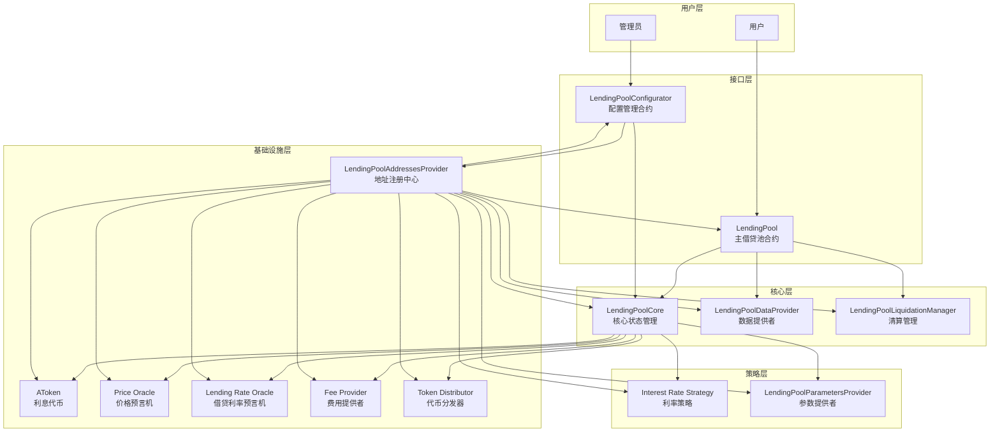

## 数据流架构图

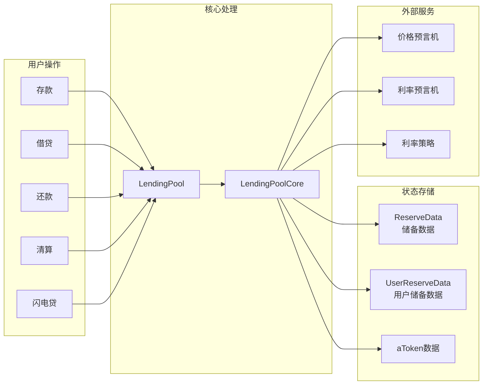

## 合约交互关系图

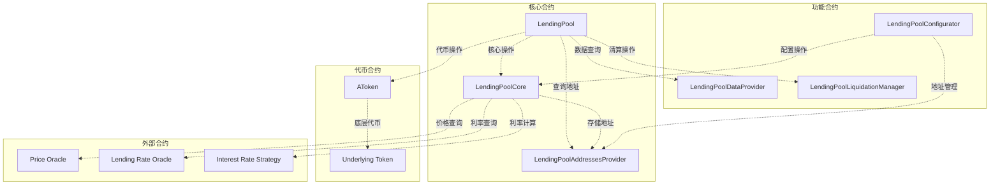

## 利率计算架构图

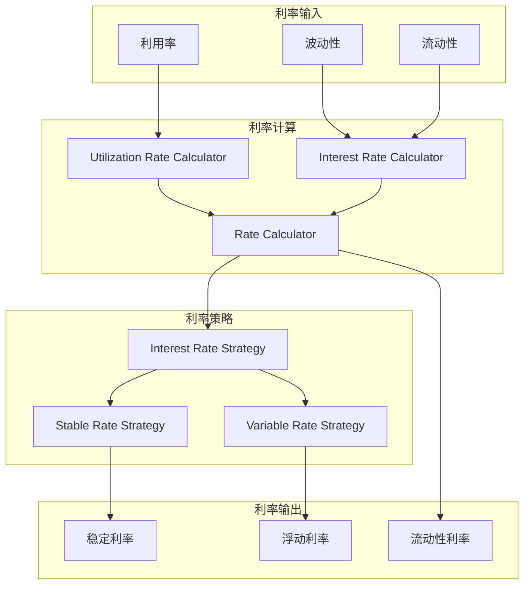

## 清算机制架构图

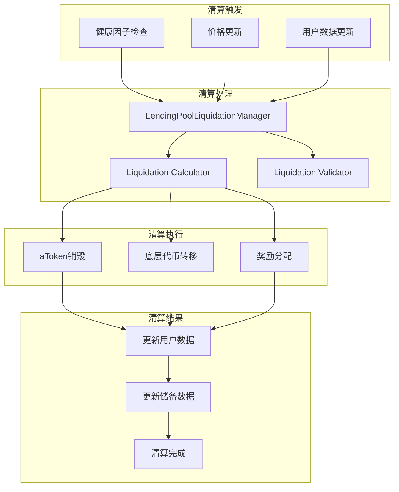

## 业务流程时序图

### 1. 存款流程时序图

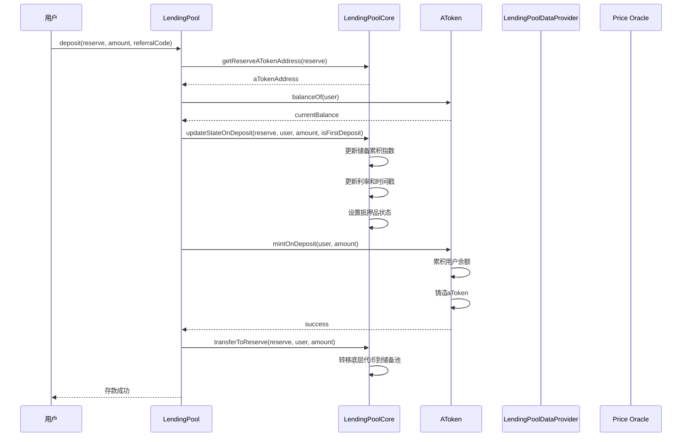

### 2. 借贷流程时序图

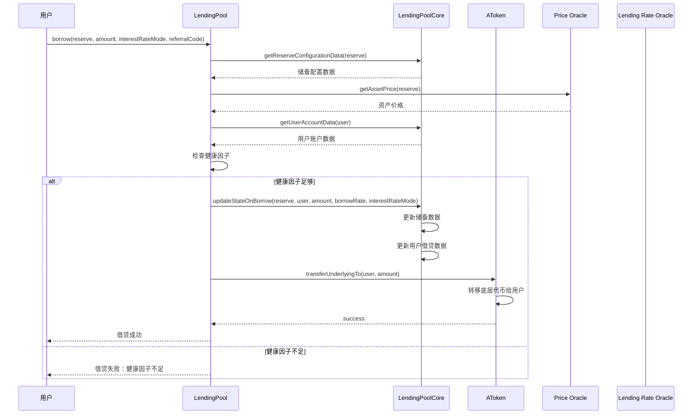

### 3. 还款流程时序图

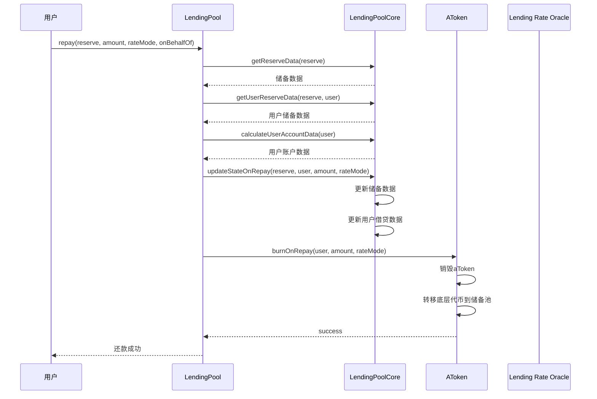

### 4. 清算流程时序图

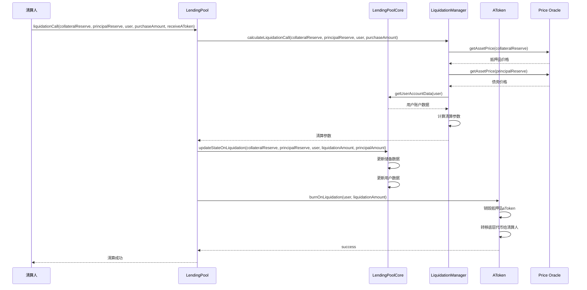

### 5. 闪电贷流程时序图

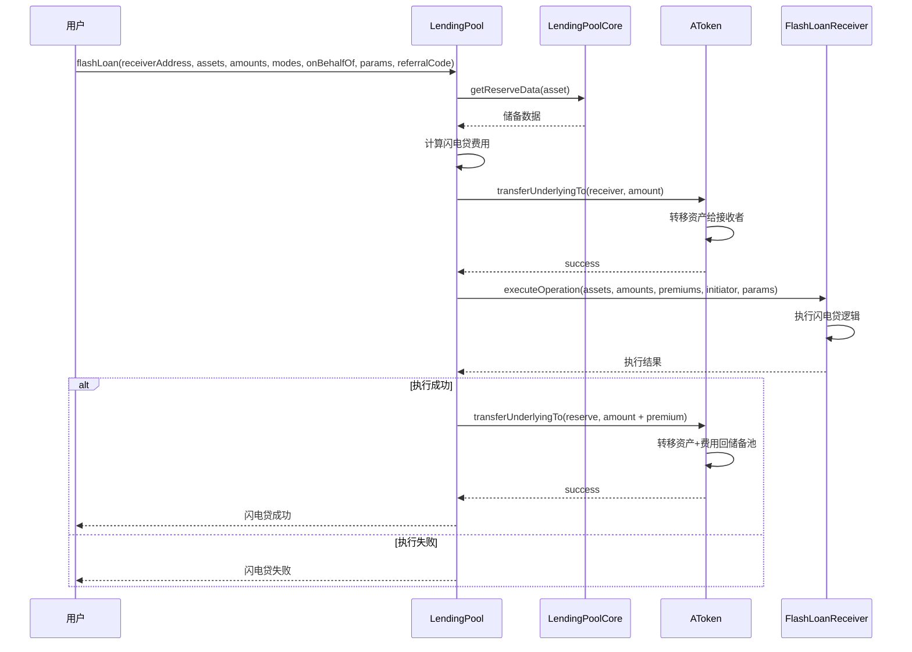

### 6. 利率切换流程时序图

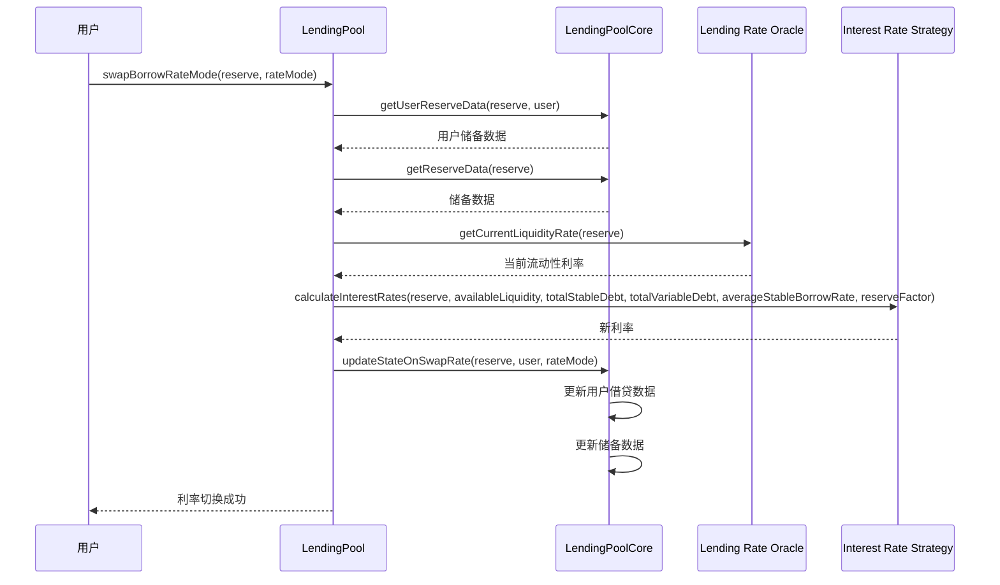

### 7. 稳定利率重平衡流程时序图

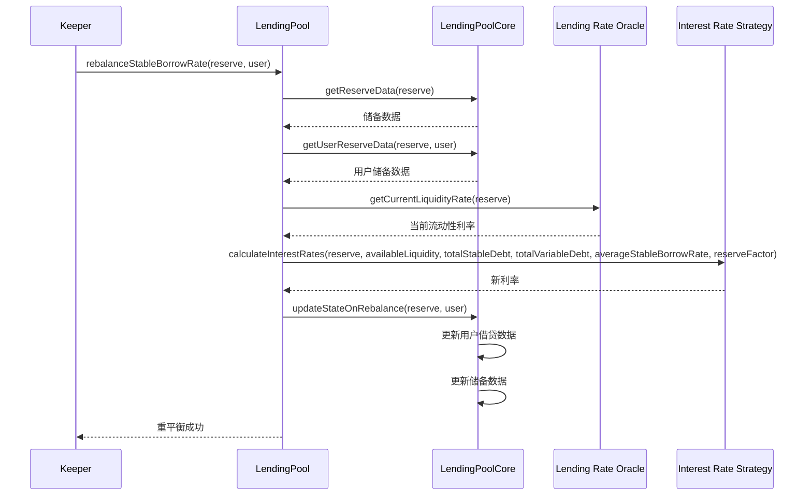

### 8. 抵押品设置流程时序图

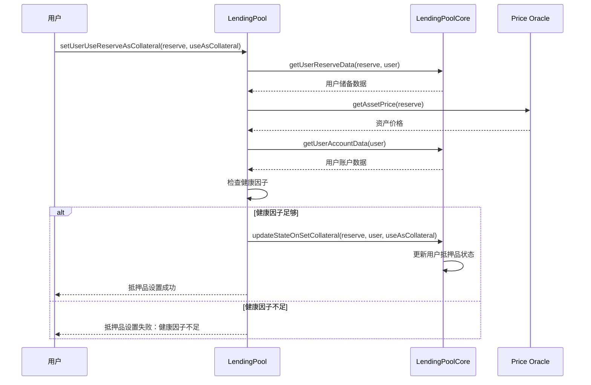

## 核心机制详解

### 1. aToken 机制

aToken 是 Aave V1 的核心创新，代表用户在协议中的存款份额：

- **实时累积利息**：aToken 余额会随着时间的推移自动增长
- **可转让性**：aToken 是标准的 ERC20 代币，可以在二级市场交易
- **利息重定向**：支持将利息重定向到其他地址
- **抵押品功能**：aToken 可以作为抵押品进行借贷

### 2. 双利率模式

Aave V1 支持两种借贷利率模式：

#### 稳定利率模式
- **固定利率**：在借贷期间利率保持相对稳定
- **重平衡机制**：通过重平衡机制调整利率
- **适合场景**：长期借贷，利率波动较大的市场

#### 浮动利率模式
- **市场利率**：利率随市场条件实时变化
- **利用率驱动**：基于储备池的利用率计算利率
- **适合场景**：短期借贷，利率相对稳定的市场

### 3. 闪电贷功能

闪电贷是 Aave V1 的独特功能：

- **无抵押借贷**：无需提供抵押品即可借入资产
- **单笔交易**：必须在同一笔交易中完成借贷和还款
- **复杂策略**：支持复杂的 DeFi 套利和策略执行
- **费用机制**：收取少量费用作为协议收入

### 4. 清算机制

清算机制确保协议的安全性：

- **健康因子**：监控用户的抵押品价值与债务价值的比率
- **清算阈值**：当健康因子低于阈值时触发清算
- **清算奖励**：清算人可以获得清算奖励
- **部分清算**：支持部分清算，减少对用户的影响

## 数据结构

### 1. ReserveData 结构

```solidity
struct ReserveData {
    // 储备配置
    ReserveConfigurationMap configuration;
    // 储备流动性索引
    uint128 liquidityIndex;
    // 储备当前流动性利率
    uint128 currentLiquidityRate;
    // 储备当前稳定借贷利率
    uint128 currentStableBorrowRate;
    // 储备当前浮动借贷利率
    uint128 currentVariableBorrowRate;
    // 储备最后更新时间戳
    uint40 lastUpdateTimestamp;
    // aToken 地址
    address aTokenAddress;
    // 稳定债务代币地址
    address stableDebtTokenAddress;
    // 浮动债务代币地址
    address variableDebtTokenAddress;
    // 储备利率策略地址
    address interestRateStrategyAddress;
    // 储备ID
    uint8 id;
}
```

### 2. UserReserveData 结构

```solidity
struct UserReserveData {
    // 储备配置
    ReserveConfigurationMap configuration;
    // 用户储备流动性索引
    uint128 liquidityIndex;
    // 用户储备原始余额
    uint128 originalStableBorrowRate;
    // 用户储备稳定借贷余额
    uint128 currentStableBorrowRate;
    // 用户储备浮动借贷余额
    uint128 principalStableDebt;
    // 用户储备稳定债务余额
    uint128 scaledVariableDebt;
    // 用户储备浮动债务余额
    uint128 stableBorrowLastUpdateTimestamp;
}
```

## 安全机制

### 1. 重入攻击防护

- **重入锁**：使用重入锁防止重入攻击
- **状态检查**：在关键操作前检查状态
- **外部调用隔离**：将外部调用放在最后执行

### 2. 溢出检查

- **SafeMath**：使用 SafeMath 库防止溢出
- **数值验证**：在计算前验证数值范围
- **边界检查**：检查计算结果是否在合理范围内

### 3. 权限控制

- **角色管理**：基于角色的权限控制系统
- **操作权限**：不同操作需要不同的权限级别
- **管理员权限**：关键操作需要管理员权限

### 4. 健康因子检查

- **实时监控**：实时监控用户的健康因子
- **清算触发**：当健康因子过低时触发清算
- **风险控制**：通过健康因子控制风险

## 升级机制

### 1. 模块化设计

- **合约分离**：核心逻辑与业务逻辑分离
- **接口抽象**：通过接口实现模块间的解耦
- **地址管理**：通过地址提供者管理合约地址

### 2. 升级流程

1. **新合约部署**：部署新版本的合约
2. **地址更新**：在地址提供者中更新合约地址
3. **权限转移**：将权限转移到新合约
4. **数据迁移**：迁移必要的数据到新合约

### 3. 向后兼容

- **接口兼容**：保持接口的向后兼容性
- **数据兼容**：确保数据结构的兼容性
- **功能兼容**：保持核心功能的兼容性

## 费用结构

### 1. 协议费用

- **借贷费用**：从借贷中收取一定比例的费用
- **闪电贷费用**：闪电贷收取固定费用
- **清算费用**：清算时收取费用

### 2. 费用分配

- **协议金库**：部分费用分配给协议金库
- **流动性提供者**：部分费用分配给流动性提供者
- **清算人奖励**：清算人获得清算奖励

### 3. 费用计算

- **动态费率**：费率根据市场条件动态调整
- **利用率影响**：利用率影响费率计算
- **风险调整**：根据风险调整费率

## 技术亮点

### 1. 高效计算

- **优化算法**：使用优化的利率计算算法
- **批量处理**：支持批量操作提高效率
- **状态缓存**：减少重复计算

### 2. 用户体验

- **简洁接口**：提供简洁易用的接口
- **事件日志**：详细的事件日志便于监控
- **错误处理**：完善的错误处理机制

### 3. 可扩展性

- **模块化设计**：便于添加新功能
- **接口抽象**：便于替换实现
- **配置灵活**：支持灵活的配置管理

## 总结

Aave V1 是一个设计精良的去中心化借贷协议，通过模块化设计、创新的 aToken 机制、双利率模式和闪电贷功能，为用户提供了灵活、安全、高效的借贷服务。其完善的清算机制、安全防护和升级机制确保了协议的稳定性和可持续性。

该协议不仅为 DeFi 生态系统提供了重要的基础设施，也为后续的 DeFi 协议设计提供了宝贵的经验和参考。通过深入理解 Aave V1 的设计思路和实现细节，可以更好地理解 DeFi 协议的核心机制和发展趋势。
