# Aave V2 完整技术文档

## 概述

Aave V2 是 Aave 协议的第二代版本，在 V1 的基础上进行了重大升级和改进。V2 保持了 V1 的核心功能，同时引入了多项创新特性，提升了协议的效率、安全性和用户体验。

### V2 相比 V1 的主要改进

1. **债务代币分离**：将稳定债务和浮动债务分离为独立的代币合约
2. **抵押品管理优化**：独立的抵押品管理合约
3. **激励系统**：引入 AAVE 代币激励系统
4. **Gas 优化**：大幅降低交易 Gas 消耗
5. **多链支持**：支持多个区块链网络
6. **增强的安全性**：更严格的安全检查和防护机制

## 系统架构

### 核心组件

Aave V2 采用更加模块化的设计，主要包含以下核心组件：

1. **LendingPool** - 主借贷池合约，处理所有用户操作
2. **LendingPoolCollateralManager** - 抵押品管理合约，处理清算逻辑
3. **LendingPoolConfigurator** - 配置管理合约，管理协议参数
4. **LendingPoolAddressesProvider** - 地址注册中心，管理合约地址
5. **AToken** - 存款代币，代表用户存款份额
6. **StableDebtToken** - 稳定债务代币，管理稳定利率借贷
7. **VariableDebtToken** - 浮动债务代币，管理浮动利率借贷
8. **AaveIncentivesController** - 激励控制器，管理 AAVE 代币奖励
9. **PriceOracle** - 价格预言机，提供资产价格
10. **InterestRateStrategy** - 利率策略，计算动态利率

### 架构特点

- **债务代币分离**：稳定债务和浮动债务使用独立的代币合约
- **模块化设计**：更清晰的职责分离，便于维护和升级
- **激励系统**：内置的 AAVE 代币激励机制
- **多链支持**：支持多个区块链网络部署
- **Gas 优化**：显著降低交易成本

## 系统整体架构图

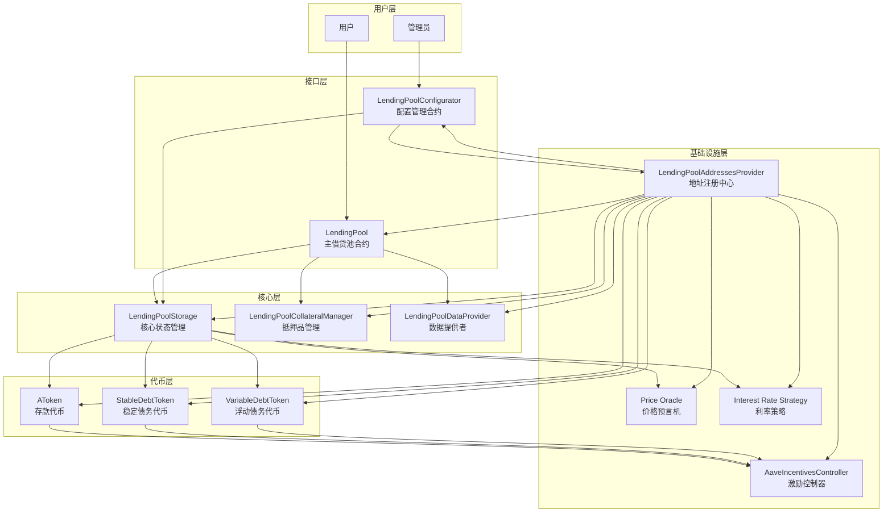

## 债务代币分离架构图

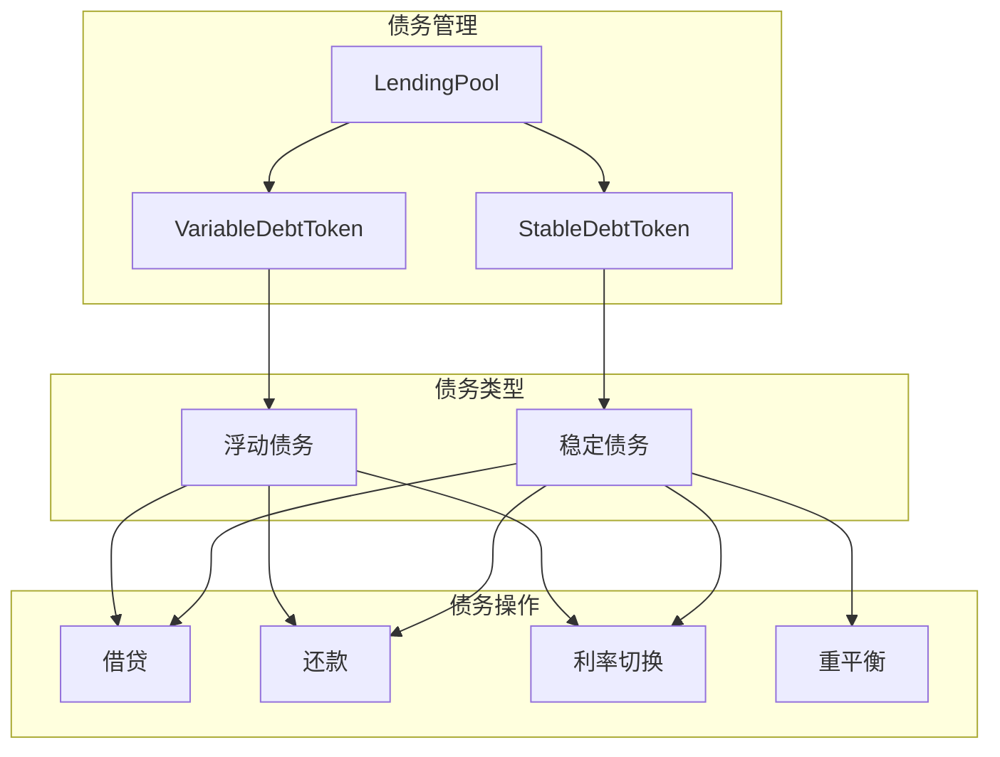

## 激励系统架构图

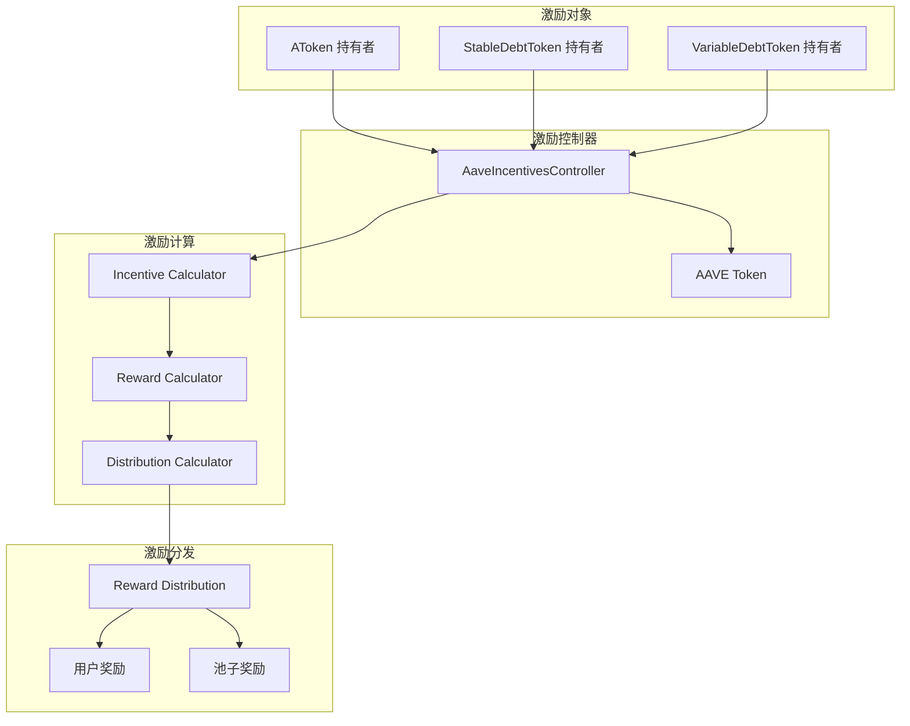

## 业务流程时序图

### 1. 存款流程时序图

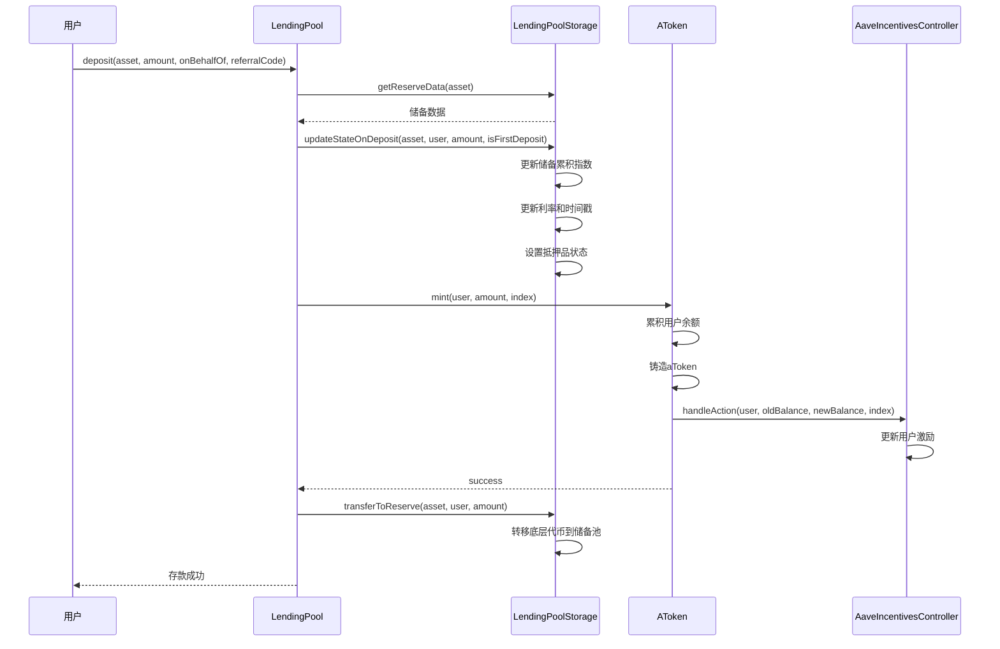

### 2. 借贷流程时序图

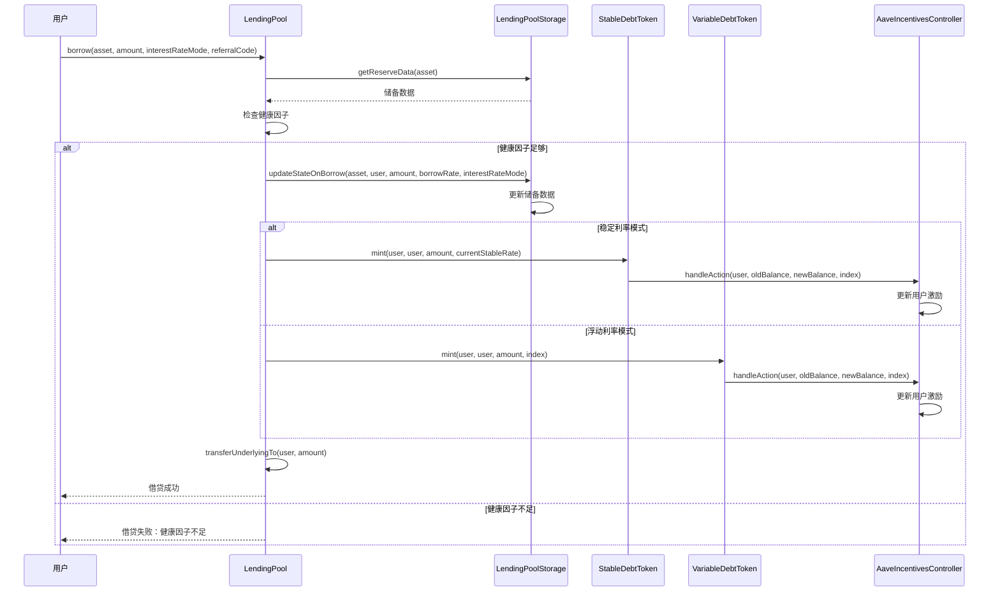

### 3. 还款流程时序图

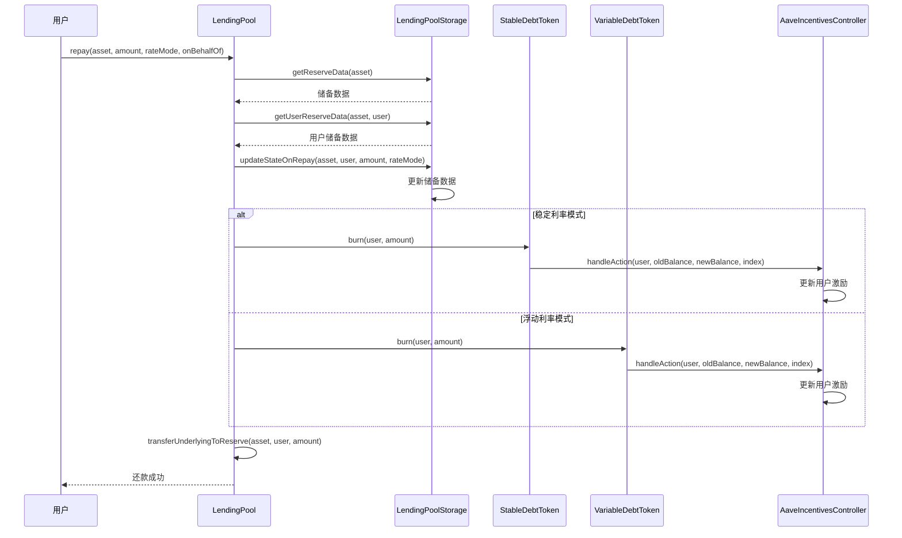

### 4. 清算流程时序图

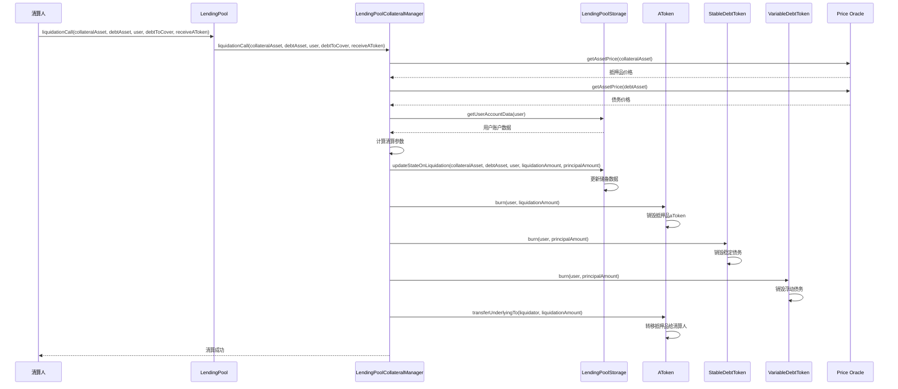

### 5. 闪电贷流程时序图

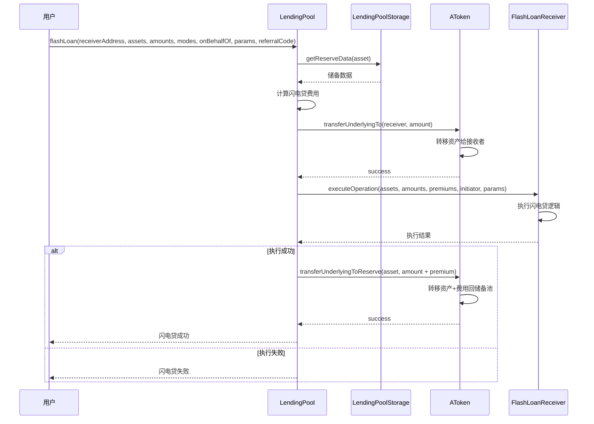

### 6. 利率切换流程时序图

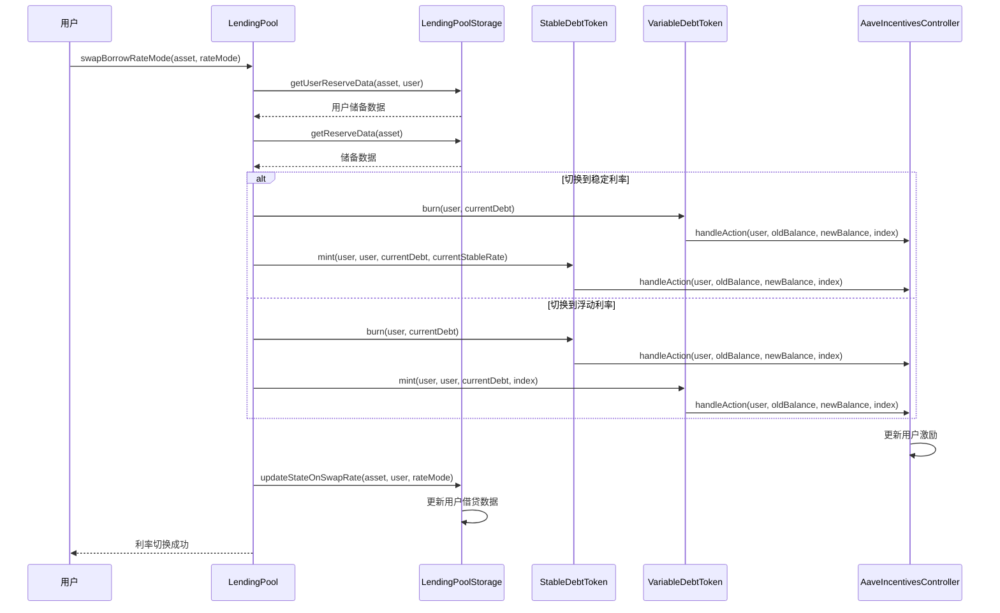

### 7. 激励领取流程时序图

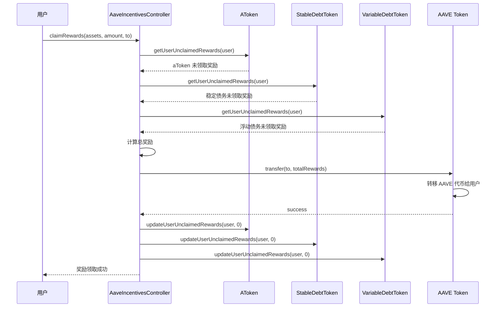

### 8. 抵押品设置流程时序图

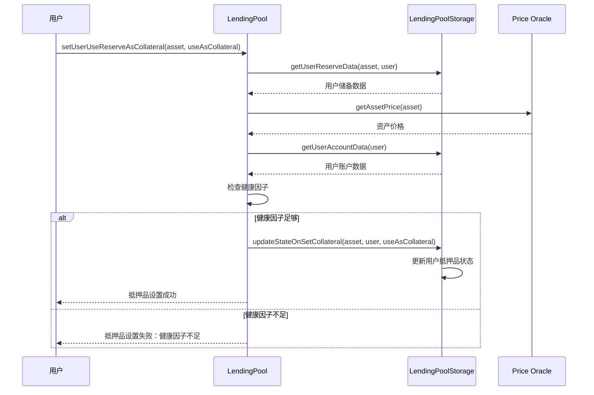

## 核心机制详解

### 1. 债务代币分离机制

Aave V2 最重要的创新是将债务代币分离：

#### StableDebtToken（稳定债务代币）
- **固定利率**：在借贷期间利率保持相对稳定
- **重平衡机制**：通过重平衡机制调整利率
- **独立管理**：独立的代币合约管理稳定债务

#### VariableDebtToken（浮动债务代币）
- **市场利率**：利率随市场条件实时变化
- **利用率驱动**：基于储备池的利用率计算利率
- **独立管理**：独立的代币合约管理浮动债务

### 2. 激励系统机制

Aave V2 引入了 AAVE 代币激励系统：

#### 激励对象
- **存款者**：持有 aToken 的用户
- **借贷者**：持有债务代币的用户
- **流动性提供者**：为协议提供流动性的用户

#### 激励计算
- **基于余额**：根据用户持有的代币余额计算奖励
- **时间加权**：考虑时间因素计算奖励
- **动态调整**：根据市场条件动态调整奖励率

#### 激励分发
- **实时累积**：奖励实时累积到用户账户
- **按需领取**：用户可以随时领取累积的奖励
- **批量操作**：支持批量领取多个资产的奖励

### 3. 抵押品管理优化

V2 引入了独立的抵押品管理合约：

#### 功能分离
- **清算逻辑**：独立的清算管理合约
- **抵押品检查**：专门的抵押品状态检查
- **清算奖励**：优化的清算奖励机制

#### 性能提升
- **Gas 优化**：显著降低清算操作的 Gas 消耗
- **批量清算**：支持批量清算操作
- **部分清算**：支持部分清算，减少对用户的影响

### 4. 多链支持

V2 支持多个区块链网络：

#### 支持的网络
- **以太坊主网**：主要的部署网络
- **Polygon**：Layer 2 扩展解决方案
- **Avalanche**：高性能区块链
- **Arbitrum**：Layer 2 扩展解决方案
- **Optimism**：Layer 2 扩展解决方案

#### 跨链特性
- **统一接口**：所有网络使用相同的接口
- **独立配置**：每个网络有独立的配置
- **本地化部署**：每个网络独立部署

## 数据结构

### 1. ReserveData 结构

```solidity
struct ReserveData {
    // 储备配置
    ReserveConfigurationMap configuration;
    // 储备流动性索引
    uint128 liquidityIndex;
    // 浮动借贷索引
    uint128 variableBorrowIndex;
    // 当前流动性利率
    uint128 currentLiquidityRate;
    // 当前浮动借贷利率
    uint128 currentVariableBorrowRate;
    // 当前稳定借贷利率
    uint128 currentStableBorrowRate;
    // 最后更新时间戳
    uint40 lastUpdateTimestamp;
    // 代币地址
    address aTokenAddress;
    address stableDebtTokenAddress;
    address variableDebtTokenAddress;
    // 利率策略地址
    address interestRateStrategyAddress;
    // 储备ID
    uint8 id;
}
```

### 2. UserConfigurationMap 结构

```solidity
struct UserConfigurationMap {
    uint256 data;
}
```

### 3. InterestRateMode 枚举

```solidity
enum InterestRateMode {NONE, STABLE, VARIABLE}
```

## 安全机制

### 1. 债务代币安全

- **独立验证**：每个债务代币独立验证
- **状态一致性**：确保债务状态的一致性
- **权限控制**：严格的权限管理

### 2. 激励系统安全

- **防重放攻击**：防止奖励重放攻击
- **数值安全**：防止数值溢出和下溢
- **权限控制**：严格的激励分发权限

### 3. 抵押品管理安全

- **清算验证**：严格的清算条件验证
- **价格安全**：多重价格验证机制
- **状态检查**：全面的状态检查

### 4. 多链安全

- **网络隔离**：各网络独立运行
- **配置验证**：严格的配置验证
- **升级安全**：安全的升级机制

## 升级机制

### 1. 模块化升级

- **独立升级**：各模块可以独立升级
- **向后兼容**：保持接口的向后兼容性
- **数据迁移**：安全的数据迁移机制

### 2. 多链升级

- **网络特定**：每个网络独立升级
- **配置管理**：统一的配置管理
- **版本控制**：严格的版本控制

### 3. 激励系统升级

- **参数调整**：可以调整激励参数
- **策略更新**：可以更新激励策略
- **代币管理**：灵活的代币管理

## 费用结构

### 1. 协议费用

- **借贷费用**：从借贷中收取费用
- **闪电贷费用**：闪电贷收取费用
- **清算费用**：清算时收取费用

### 2. 激励费用

- **AAVE 代币**：使用 AAVE 代币作为激励
- **通胀机制**：通过通胀产生激励代币
- **分发机制**：公平的分发机制

### 3. 多链费用

- **网络费用**：各网络独立收费
- **跨链费用**：跨链操作费用
- **Gas 优化**：优化的 Gas 消耗

## 技术亮点

### 1. 债务代币分离

- **独立管理**：稳定债务和浮动债务独立管理
- **灵活切换**：用户可以灵活切换利率模式
- **精确计算**：更精确的利息计算

### 2. 激励系统

- **代币激励**：使用 AAVE 代币激励用户
- **实时累积**：奖励实时累积
- **灵活领取**：用户可以灵活领取奖励

### 3. Gas 优化

- **批量操作**：支持批量操作
- **状态优化**：优化的状态管理
- **计算优化**：优化的计算逻辑

### 4. 多链支持

- **统一接口**：所有网络使用相同接口
- **独立部署**：每个网络独立部署
- **灵活配置**：灵活的配置管理

## V2 相比 V1 的主要改进

### 1. 架构改进

- **债务代币分离**：将债务代币分离为独立合约
- **抵押品管理**：独立的抵押品管理合约
- **激励系统**：内置的激励系统

### 2. 功能改进

- **Gas 优化**：显著降低 Gas 消耗
- **多链支持**：支持多个区块链网络
- **激励机制**：引入代币激励机制

### 3. 安全改进

- **更严格的验证**：更严格的安全验证
- **独立审计**：独立的合约审计
- **多重保护**：多重安全保护机制

### 4. 用户体验改进

- **更低的成本**：更低的交易成本
- **更好的性能**：更好的性能表现
- **更多功能**：更多的功能特性

## 总结

Aave V2 在 V1 的基础上进行了重大升级，通过债务代币分离、激励系统、抵押品管理优化等创新，显著提升了协议的效率、安全性和用户体验。V2 不仅保持了 V1 的核心功能，还引入了多项新特性，为 DeFi 生态系统提供了更加强大和灵活的基础设施。

V2 的成功证明了 Aave 团队在 DeFi 协议设计方面的创新能力，也为后续的 V3 版本奠定了坚实的基础。通过深入理解 V2 的设计思路和实现细节，可以更好地理解 DeFi 协议的发展趋势和未来方向。
