# Aave V3 完整技术文档

## 概述

Aave V3 是 Aave 协议的第三代版本，在 V2 的基础上进行了重大升级和创新。V3 引入了多项革命性的新特性，包括效率模式（eMode）、隔离模式（Isolation Mode）、跨链桥接功能等，进一步提升了协议的效率、安全性和用户体验。

### V3 相比 V2 的主要创新

1. **效率模式（eMode）**：为相关资产提供更高的资本效率
2. **隔离模式（Isolation Mode）**：支持高风险资产的隔离借贷
3. **跨链桥接**：支持跨链资产的无抵押铸造
4. **供应和借贷上限**：更精细的风险管理
5. **债务上限**：隔离模式的债务限制机制
6. **增强的清算机制**：更灵活的清算策略
7. **Gas 进一步优化**：更低的交易成本
8. **多链原生支持**：原生支持多个区块链网络

## 系统架构

### 核心组件

Aave V3 采用更加模块化和高效的设计，主要包含以下核心组件：

1. **Pool** - 主池合约，处理所有用户操作
2. **PoolConfigurator** - 配置管理合约，管理协议参数
3. **PoolAddressesProvider** - 地址注册中心，管理合约地址
4. **AToken** - 存款代币，代表用户存款份额
5. **StableDebtToken** - 稳定债务代币，管理稳定利率借贷
6. **VariableDebtToken** - 浮动债务代币，管理浮动利率借贷
7. **AaveIncentivesController** - 激励控制器，管理 AAVE 代币奖励
8. **PriceOracle** - 价格预言机，提供资产价格
9. **InterestRateStrategy** - 利率策略，计算动态利率
10. **ACLManager** - 访问控制管理器，管理权限
11. **EModeLogic** - 效率模式逻辑
12. **IsolationModeLogic** - 隔离模式逻辑
13. **BridgeLogic** - 跨链桥接逻辑

### 架构特点

- **效率模式**：为相关资产提供更高的资本效率
- **隔离模式**：支持高风险资产的隔离借贷
- **跨链桥接**：支持跨链资产的无抵押铸造
- **精细风险管理**：供应和借贷上限、债务上限等
- **增强的清算**：更灵活的清算策略
- **多链原生支持**：原生支持多个区块链网络

## 系统整体架构图

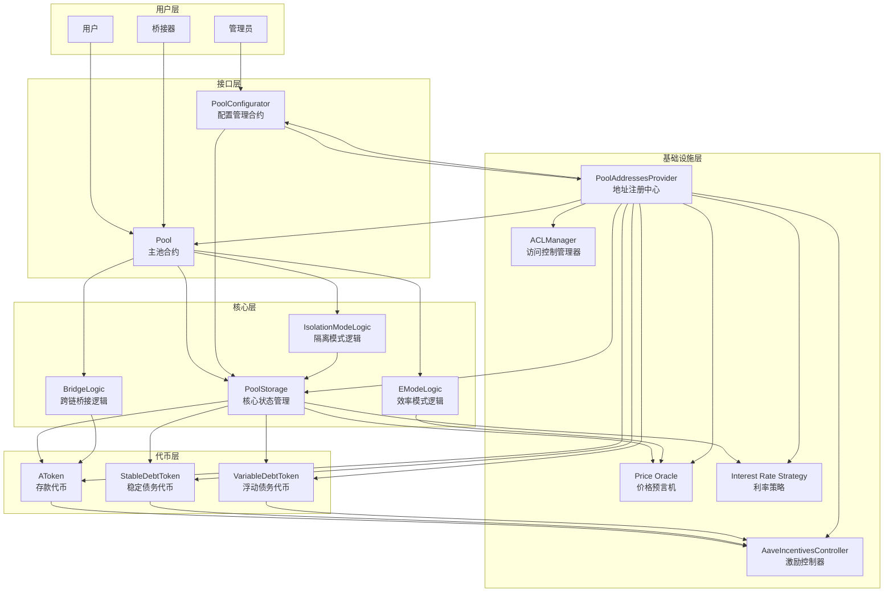

## 效率模式（eMode）架构图

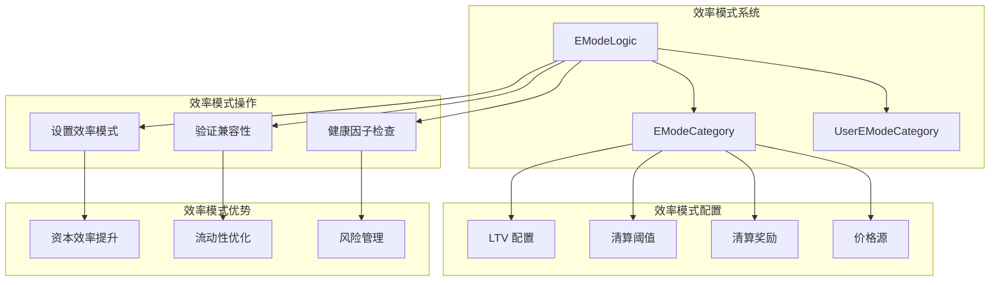

## 隔离模式（Isolation Mode）架构图

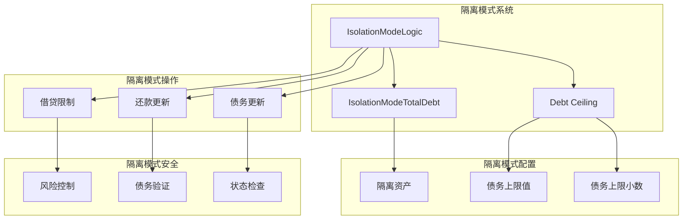

## 跨链桥接架构图

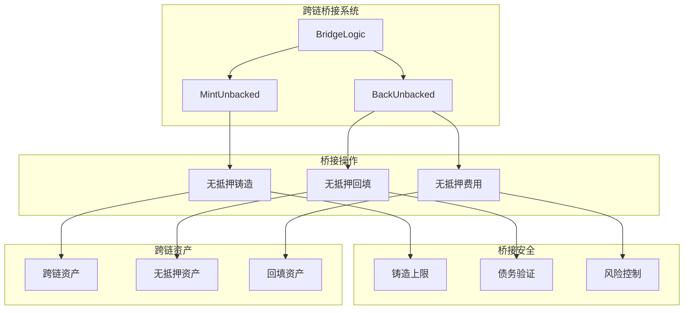

## 业务流程时序图

### 1. 供应流程时序图

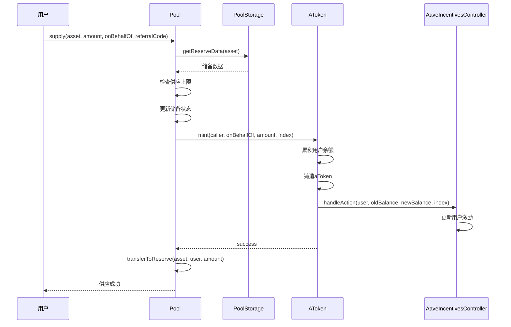

### 2. 借贷流程时序图

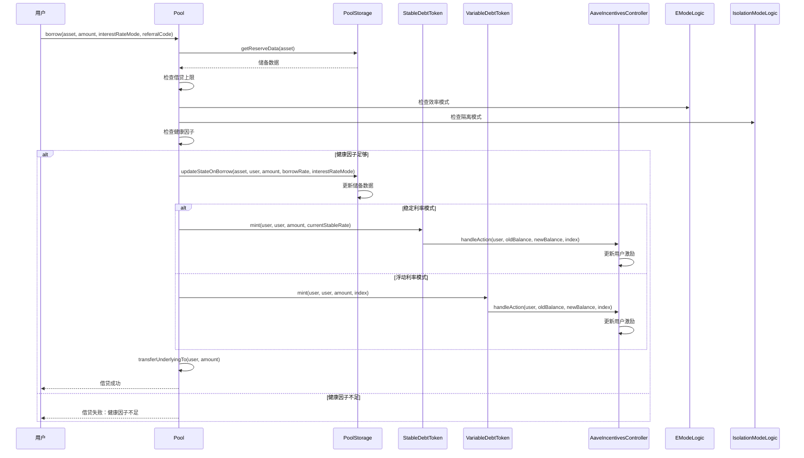

### 3. 还款流程时序图

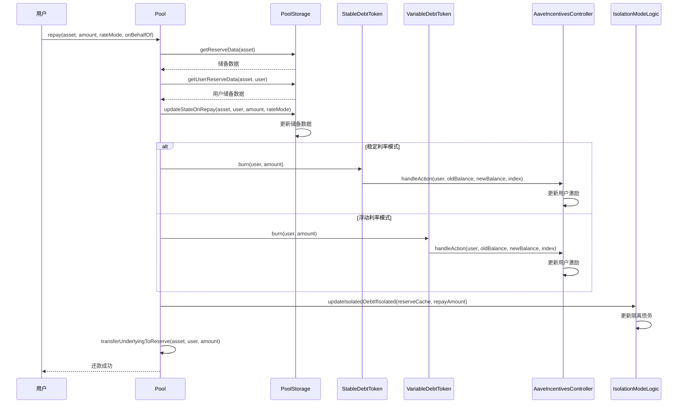

### 4. 清算流程时序图

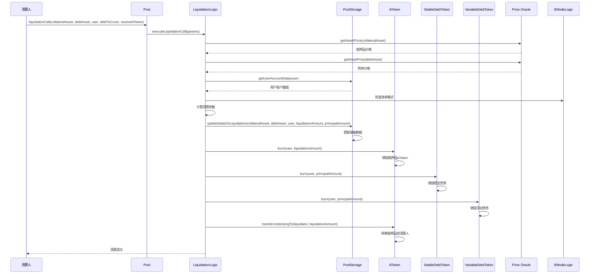

### 5. 闪电贷流程时序图

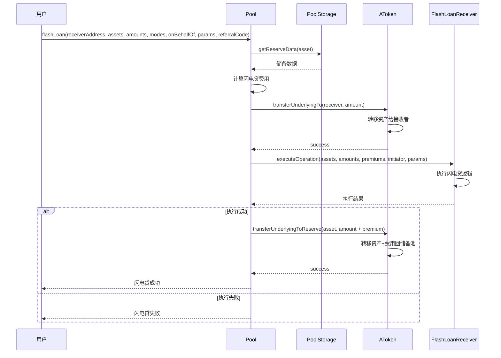

### 6. 效率模式设置流程时序图

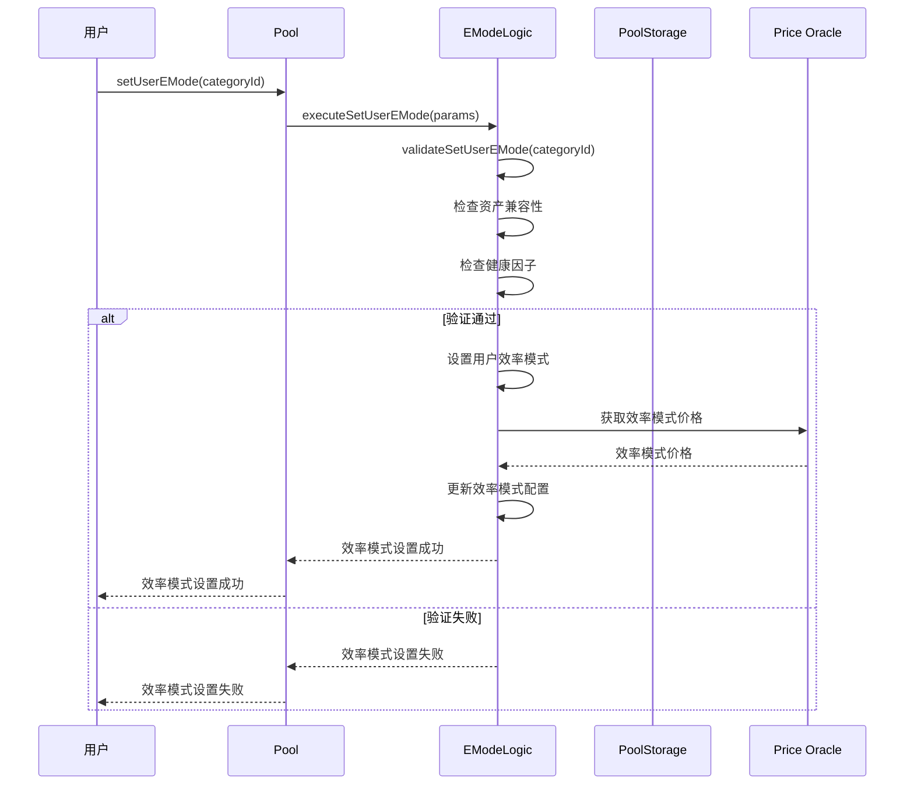

### 7. 隔离模式借贷流程时序图

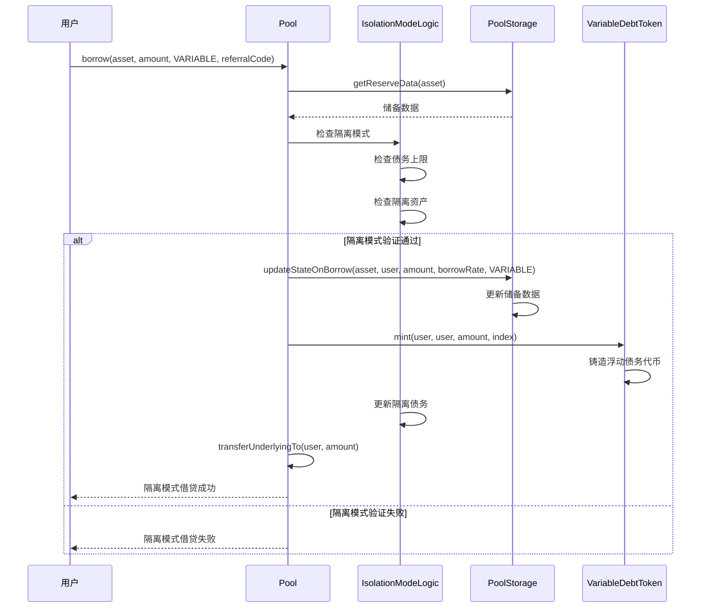

### 8. 跨链桥接流程时序图

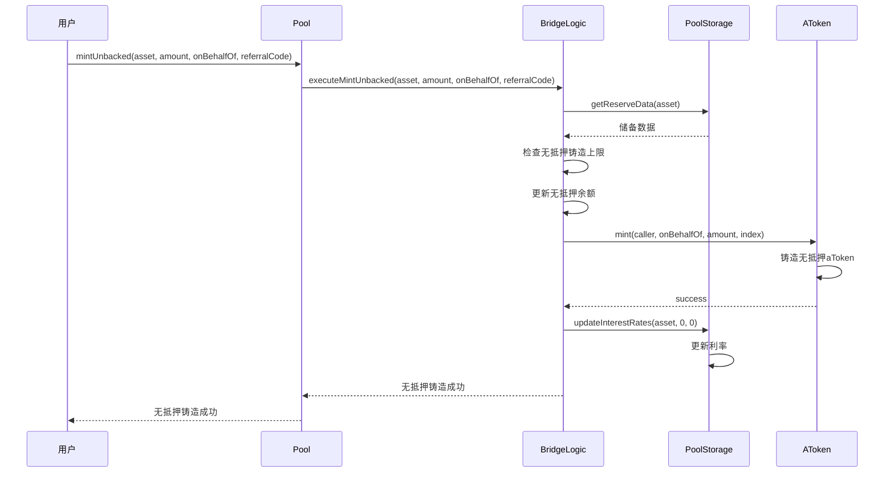

## 核心机制详解

### 1. 效率模式（eMode）机制

效率模式是 V3 最重要的创新之一：

#### 核心概念
- **相关资产**：具有高度相关性的资产（如 ETH 和 stETH）
- **统一价格源**：使用相同的价格预言机
- **提高 LTV**：允许更高的借贷价值比
- **降低清算阈值**：更灵活的清算条件

#### 效率模式配置
```solidity
struct EModeCategory {
    uint16 ltv;                    // 借贷价值比
    uint16 liquidationThreshold;   // 清算阈值
    uint16 liquidationBonus;       // 清算奖励
    address priceSource;           // 价格源
    string label;                  // 标签
}
```

#### 效率模式优势
- **资本效率**：提高相关资产的资本效率
- **流动性优化**：更好的流动性管理
- **风险管理**：统一的风险管理策略

### 2. 隔离模式（Isolation Mode）机制

隔离模式支持高风险资产的隔离借贷：

#### 核心概念
- **隔离资产**：高风险或新上线的资产
- **债务上限**：限制隔离资产的借贷总量
- **隔离借贷**：只能借贷隔离资产
- **风险隔离**：防止风险传播到其他资产

#### 隔离模式配置
- **债务上限**：设置隔离资产的最大借贷量
- **隔离资产**：指定哪些资产可以隔离借贷
- **债务追踪**：实时追踪隔离债务

#### 隔离模式安全
- **风险控制**：严格的借贷限制
- **债务验证**：实时验证债务状态
- **状态检查**：全面的状态检查

### 3. 跨链桥接机制

V3 引入了跨链桥接功能：

#### 核心功能
- **无抵押铸造**：跨链资产的无抵押铸造
- **无抵押回填**：跨链资产的无抵押回填
- **跨链费用**：跨链操作的费用机制

#### 桥接操作
- **MintUnbacked**：铸造无抵押 aToken
- **BackUnbacked**：回填无抵押资产
- **费用计算**：计算跨链操作费用

#### 桥接安全
- **铸造上限**：限制无抵押铸造量
- **债务验证**：验证跨链债务
- **风险控制**：控制跨链风险

### 4. 供应和借贷上限机制

V3 引入了更精细的风险管理：

#### 供应上限
- **总供应上限**：限制资产的总供应量
- **用户供应上限**：限制单个用户的供应量
- **动态调整**：根据市场条件动态调整

#### 借贷上限
- **总借贷上限**：限制资产的总借贷量
- **用户借贷上限**：限制单个用户的借贷量
- **动态调整**：根据市场条件动态调整

### 5. 增强的清算机制

V3 改进了清算机制：

#### 清算策略
- **部分清算**：支持部分清算
- **批量清算**：支持批量清算
- **清算奖励**：优化的清算奖励机制

#### 清算验证
- **健康因子检查**：严格的健康因子验证
- **价格验证**：多重价格验证
- **状态检查**：全面的状态检查

## 数据结构

### 1. ReserveData 结构

```solidity
struct ReserveData {
    // 储备配置
    ReserveConfigurationMap configuration;
    // 储备流动性索引
    uint128 liquidityIndex;
    // 当前流动性利率
    uint128 currentLiquidityRate;
    // 浮动借贷索引
    uint128 variableBorrowIndex;
    // 当前浮动借贷利率
    uint128 currentVariableBorrowRate;
    // 当前稳定借贷利率
    uint128 currentStableBorrowRate;
    // 最后更新时间戳
    uint40 lastUpdateTimestamp;
    // 储备ID
    uint16 id;
    // 代币地址
    address aTokenAddress;
    address stableDebtTokenAddress;
    address variableDebtTokenAddress;
    // 利率策略地址
    address interestRateStrategyAddress;
    // 当前国库余额
    uint128 accruedToTreasury;
    // 无抵押aToken数量
    uint128 unbacked;
    // 隔离模式总债务
    uint128 isolationModeTotalDebt;
}
```

### 2. EModeCategory 结构

```solidity
struct EModeCategory {
    uint16 ltv;                    // 借贷价值比
    uint16 liquidationThreshold;   // 清算阈值
    uint16 liquidationBonus;       // 清算奖励
    address priceSource;           // 价格源
    string label;                  // 标签
}
```

### 3. ReserveConfigurationMap 结构

```solidity
struct ReserveConfigurationMap {
    // bit 0-15: LTV
    // bit 16-31: 清算阈值
    // bit 32-47: 清算奖励
    // bit 48-55: 小数位数
    // bit 56: 储备是否激活
    // bit 57: 储备是否冻结
    // bit 58: 借贷是否启用
    // bit 59: 稳定利率借贷是否启用
    // bit 60: 资产是否暂停
    // bit 61: 隔离模式借贷是否启用
    // bit 62: 隔离借贷是否启用
    // bit 63: 闪电贷是否启用
    // bit 64-79: 储备因子
    // bit 80-115: 借贷上限
    // bit 116-151: 供应上限
    // bit 152-167: 清算协议费用
    // bit 168-175: 效率模式类别
    // bit 176-211: 无抵押铸造上限
    // bit 212-251: 隔离模式债务上限
    // bit 252-255: 未使用
    uint256 data;
}
```

## 安全机制

### 1. 效率模式安全

- **兼容性验证**：严格验证资产兼容性
- **健康因子检查**：确保健康因子足够
- **价格验证**：多重价格验证机制

### 2. 隔离模式安全

- **债务上限**：严格的债务上限控制
- **风险隔离**：防止风险传播
- **状态验证**：实时状态验证

### 3. 跨链桥接安全

- **铸造上限**：限制无抵押铸造量
- **债务验证**：验证跨链债务
- **风险控制**：控制跨链风险

### 4. 供应和借贷上限安全

- **上限检查**：严格的上限检查
- **动态调整**：安全的动态调整
- **状态验证**：全面的状态验证

### 5. 增强的清算安全

- **清算验证**：严格的清算条件验证
- **价格安全**：多重价格验证机制
- **状态检查**：全面的状态检查

## 升级机制

### 1. 模块化升级

- **独立升级**：各模块可以独立升级
- **向后兼容**：保持接口的向后兼容性
- **数据迁移**：安全的数据迁移机制

### 2. 多链升级

- **网络特定**：每个网络独立升级
- **配置管理**：统一的配置管理
- **版本控制**：严格的版本控制

### 3. 新功能升级

- **效率模式升级**：可以添加新的效率模式类别
- **隔离模式升级**：可以调整隔离模式参数
- **桥接功能升级**：可以升级桥接功能

## 费用结构

### 1. 协议费用

- **借贷费用**：从借贷中收取费用
- **闪电贷费用**：闪电贷收取费用
- **清算费用**：清算时收取费用
- **跨链费用**：跨链操作费用

### 2. 激励费用

- **AAVE 代币**：使用 AAVE 代币作为激励
- **通胀机制**：通过通胀产生激励代币
- **分发机制**：公平的分发机制

### 3. 多链费用

- **网络费用**：各网络独立收费
- **跨链费用**：跨链操作费用
- **Gas 优化**：优化的 Gas 消耗

## 技术亮点

### 1. 效率模式

- **资本效率**：显著提高相关资产的资本效率
- **流动性优化**：更好的流动性管理
- **风险管理**：统一的风险管理策略

### 2. 隔离模式

- **风险隔离**：有效隔离高风险资产
- **债务控制**：严格的债务上限控制
- **安全借贷**：支持高风险资产的安全借贷

### 3. 跨链桥接

- **无抵押铸造**：支持跨链资产的无抵押铸造
- **跨链流动性**：提高跨链流动性
- **费用优化**：优化的跨链费用

### 4. 精细风险管理

- **供应上限**：精确的供应量控制
- **借贷上限**：精确的借贷量控制
- **动态调整**：根据市场条件动态调整

### 5. 增强的清算

- **部分清算**：支持部分清算
- **批量清算**：支持批量清算
- **清算优化**：优化的清算策略

## V3 相比 V2 的主要改进

### 1. 架构改进

- **效率模式**：引入效率模式机制
- **隔离模式**：引入隔离模式机制
- **跨链桥接**：引入跨链桥接功能
- **精细风险管理**：更精细的风险管理

### 2. 功能改进

- **资本效率**：显著提高资本效率
- **风险隔离**：有效隔离风险
- **跨链支持**：原生跨链支持
- **Gas 优化**：进一步降低 Gas 消耗

### 3. 安全改进

- **多重验证**：更严格的安全验证
- **风险控制**：更精细的风险控制
- **状态检查**：更全面的状态检查
- **隔离保护**：有效的风险隔离

### 4. 用户体验改进

- **更高效率**：更高的资本效率
- **更多功能**：更多的功能特性
- **更低成本**：更低的交易成本
- **更好体验**：更好的用户体验

## 总结

Aave V3 在 V2 的基础上进行了革命性的升级，通过效率模式、隔离模式、跨链桥接等创新功能，显著提升了协议的效率、安全性和用户体验。V3 不仅保持了 V1 和 V2 的核心功能，还引入了多项革命性的新特性，为 DeFi 生态系统提供了更加强大和灵活的基础设施。

V3 的成功证明了 Aave 团队在 DeFi 协议设计方面的持续创新能力，也为后续的版本发展奠定了坚实的基础。通过深入理解 V3 的设计思路和实现细节，可以更好地理解 DeFi 协议的发展趋势和未来方向。

V3 的模块化设计和多链原生支持，使其能够适应不断变化的 DeFi 生态系统，为用户提供更加高效、安全和便捷的借贷服务。
