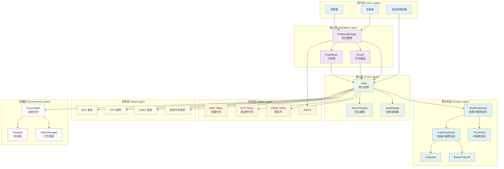
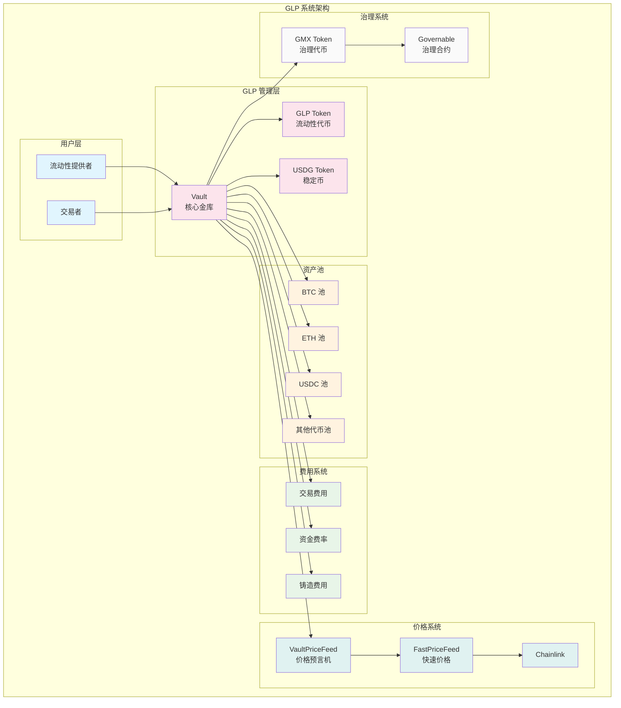
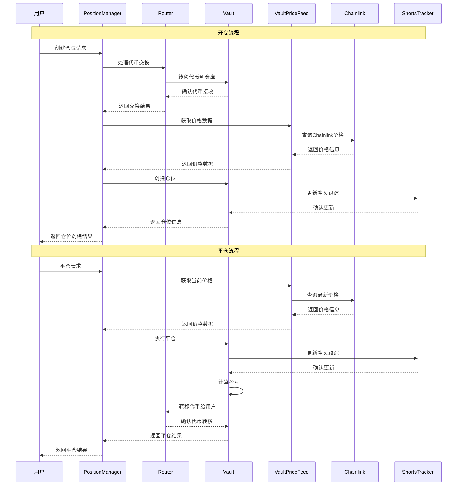
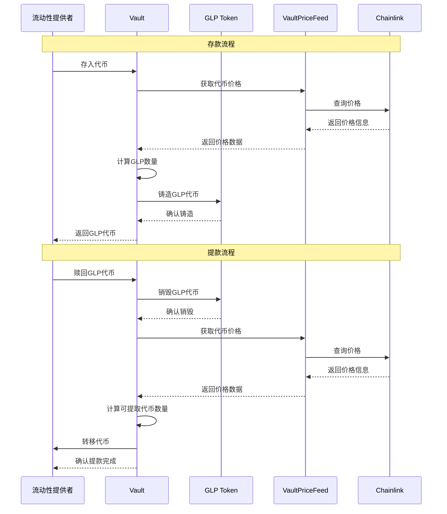
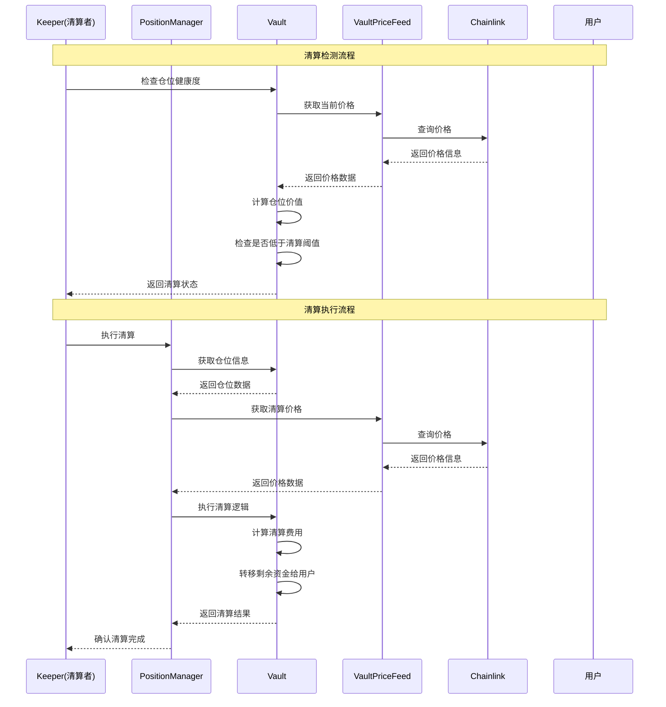
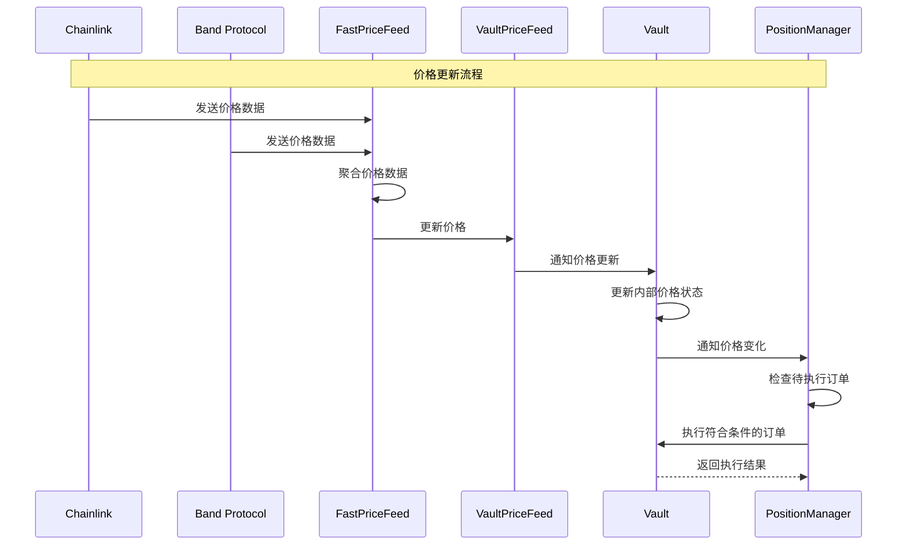

# GMX V1 项目文档

## 项目介绍

GMX V1 是一个去中心化的永续合约交易协议，基于 Arbitrum 和 Avalanche 网络构建。该协议允许用户以高达 50 倍杠杆进行加密货币的永续合约交易，同时为流动性提供者提供收益机会。

### 核心特性

- **永续合约交易**: 支持高达 50 倍杠杆的加密货币永续合约交易
- **去中心化价格预言机**: 使用 Chainlink 和 Band Protocol 等去中心化预言机获取价格数据
- **流动性挖矿**: 通过 GLP (GMX Liquidity Provider) 代币为流动性提供者提供收益
- **低滑点交易**: 通过优化的 AMM 机制减少交易滑点
- **多链支持**: 支持 Arbitrum 和 Avalanche 网络

## 架构设计

### 系统架构图

### 核心合约结构

#### 1. Vault 合约 (`Vault.sol`)
- **功能**: 系统的核心金库，管理所有资金和仓位
- **主要职责**:
  - 存储和管理所有代币余额
  - 处理仓位的开仓、平仓和调整
  - 管理保证金和清算机制
  - 计算资金费率

#### 2. PositionManager 合约 (`PositionManager.sol`)
- **功能**: 管理用户仓位的创建和修改
- **主要职责**:
  - 处理仓位的增加和减少
  - 验证仓位参数（杠杆、保证金等）
  - 与 Vault 合约交互执行仓位操作

#### 3. Router 合约 (`Router.sol`)
- **功能**: 处理代币交换和路由
- **主要职责**:
  - 管理代币交换路径
  - 处理代币转账
  - 与外部 DEX 集成

#### 4. 价格预言机系统
- **VaultPriceFeed.sol**: 主要价格预言机合约
- **FastPriceFeed.sol**: 快速价格更新机制
- **PriceFeed.sol**: 价格数据存储和验证

#### 5. 代币系统

##### GLP 系统架构图

##### 代币系统
- **GMX.sol**: 治理代币
- **GLP.sol**: 流动性提供者代币
- **USDG.sol**: 稳定币代币

### 数据流架构

#### 交易流程架构图

#### 流动性提供流程架构图

#### 清算流程架构图

#### 价格更新流程架构图

### 关键机制

#### 1. 仓位管理
- 仓位结构包含：大小、保证金、平均价格、资金费率、储备金额等
- 支持多头和空头仓位
- 动态调整杠杆和保证金要求

#### 2. 清算机制
- 当仓位的保证金率低于最低要求时触发清算
- 清算费用为 100 USD
- 支持部分清算和完全清算

#### 3. 资金费率
- 每 8 小时更新一次
- 基于多空仓位不平衡计算
- 用于平衡多空仓位

#### 4. 费用结构
- 开仓费用：0.1%
- 平仓费用：0.1%
- 交换费用：0.3%（稳定币 0.04%）
- 铸造/销毁费用：0.3%

## 技术特点

### 1. 安全性
- 使用 OpenZeppelin 的安全库
- 重入攻击保护
- 权限管理系统
- 多重签名治理

### 2. 可升级性
- 使用代理模式支持合约升级
- 时间锁机制防止恶意升级
- 分阶段部署和验证

### 3. 效率优化
- 批量操作减少 Gas 消耗
- 优化的存储布局
- 事件驱动的状态更新

## 部署信息

### 网络支持
- **Arbitrum**: 主网部署
- **Avalanche**: 主网部署

### 主要合约地址
- Vault: 核心金库合约
- PositionManager: 仓位管理合约
- Router: 路由合约
- GLP: 流动性代币合约

## 使用场景

### 1. 交易者
- 进行高杠杆永续合约交易
- 利用低滑点进行大额交易
- 通过做空对冲风险

### 2. 流动性提供者
- 提供流动性获得 GLP 代币
- 通过交易费用和资金费率获得收益
- 参与治理决策

### 3. 套利者
- 利用价格差异进行套利
- 通过资金费率套利
- 跨链套利机会

## 风险提示

1. **智能合约风险**: 代码可能存在漏洞
2. **流动性风险**: 极端市场条件下可能出现流动性不足
3. **预言机风险**: 价格数据可能被操纵
4. **清算风险**: 高杠杆交易面临强制清算风险
5. **监管风险**: 不同司法管辖区可能有不同的监管要求

## 总结

GMX V1 是一个功能完整的去中心化永续合约交易协议，通过创新的 AMM 机制和去中心化预言机系统，为用户提供了高效、低成本的交易体验。其模块化的架构设计确保了系统的可维护性和可扩展性，为后续的 V2 升级奠定了基础。
