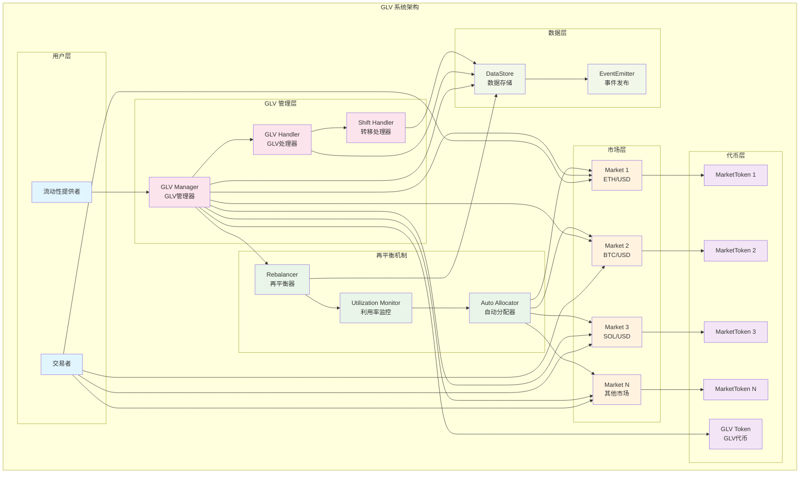
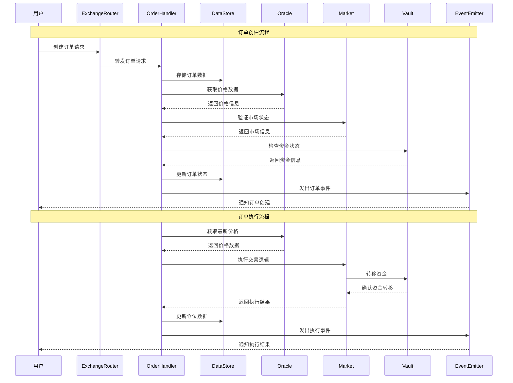
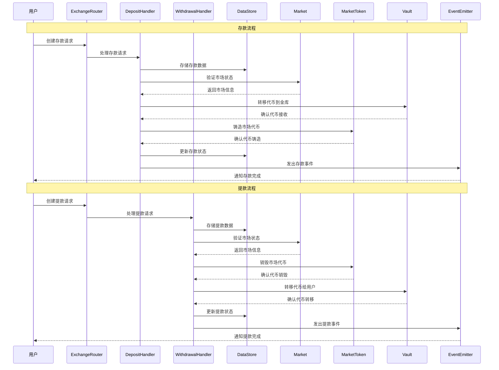
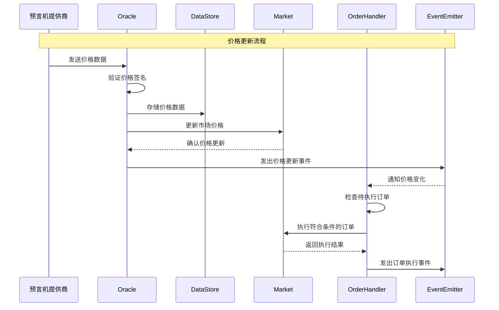

# GMX V2 (Synthetics) 项目文档

## 项目介绍

GMX V2 (Synthetics) 是 GMX 协议的重大升级版本，引入了全新的合成资产交易系统。与 V1 相比，V2 采用了更加模块化和灵活的架构设计，支持现货交易、永续合约交易，以及创新的市场隔离机制。

### 核心特性

- **多市场支持**: 支持现货和永续合约交易
- **市场隔离**: 每个市场独立管理，降低系统性风险
- **GLV (GMX Liquidity Vault)**: 多市场流动性池的自动再平衡机制
- **增强的预言机系统**: 支持多数据源和更精确的价格发现
- **模块化架构**: 高度模块化的合约设计，便于升级和维护
- **多链支持**: 支持 Arbitrum、Avalanche 等多个网络

## 架构设计

### 系统架构图

```mermaid
graph TB
    %% 用户层
    subgraph "用户层 (User Layer)"
        U1[交易者]
        U2[流动性提供者]
        U3[开发者]
    end

    %% 接口层
    subgraph "接口层 (Interface Layer)"
        ER[ExchangeRouter<br/>交易路由]
        R[Router<br/>代币路由]
    end

    %% 处理层
    subgraph "处理层 (Handler Layer)"
        OH[OrderHandler<br/>订单处理]
        DH[DepositHandler<br/>存款处理]
        WH[WithdrawalHandler<br/>提款处理]
        SH[SwapHandler<br/>交换处理]
    end

    %% 市场层
    subgraph "市场层 (Market Layer)"
        MF[MarketFactory<br/>市场工厂]
        M1[Market 1<br/>ETH/USD]
        M2[Market 2<br/>BTC/USD]
        M3[Market N<br/>其他市场]
        MT1[MarketToken 1]
        MT2[MarketToken 2]
        MT3[MarketToken N]
    end

    %% GLV层
    subgraph "GLV层 (GLV Layer)"
        GLV[GLV Manager<br/>流动性金库管理]
        GLVH[GLV Handler<br/>GLV处理]
        SHIFT[Shift Handler<br/>转移处理]
    end

    %% 数据层
    subgraph "数据层 (Data Layer)"
        DS[DataStore<br/>数据存储]
        EE[EventEmitter<br/>事件发布]
        KEYS[Keys<br/>键值管理]
    end

    %% 预言机层
    subgraph "预言机层 (Oracle Layer)"
        O[Oracle<br/>价格预言机]
        OP1[Chainlink]
        OP2[Pyth]
        OP3[其他数据源]
    end

    %% 金库层
    subgraph "金库层 (Vault Layer)"
        MV[MultichainVault<br/>多链金库]
        OV[OrderVault<br/>订单金库]
        DV[DepositVault<br/>存款金库]
        WV[WithdrawalVault<br/>提款金库]
    end

    %% 权限层
    subgraph "权限层 (Role Layer)"
        RS[RoleStore<br/>角色存储]
        TC[TimelockController<br/>时间锁控制器]
        CONFIG[Config<br/>配置管理]
    end

    %% 连接关系
    U1 --> ER
    U2 --> ER
    U3 --> ER

    ER --> OH
    ER --> DH
    ER --> WH
    ER --> R

    OH --> MF
    DH --> MF
    WH --> MF
    SH --> MF

    MF --> M1
    MF --> M2
    MF --> M3

    M1 --> MT1
    M2 --> MT2
    M3 --> MT3

    OH --> GLV
    DH --> GLV
    WH --> GLV
    GLV --> GLVH
    GLV --> SHIFT

    OH --> DS
    DH --> DS
    WH --> DS
    GLV --> DS

    DS --> EE
    DS --> KEYS

    OH --> O
    DH --> O
    WH --> O
    O --> OP1
    O --> OP2
    O --> OP3

    OH --> MV
    DH --> DV
    WH --> WV
    OH --> OV

    OH --> RS
    DH --> RS
    WH --> RS
    RS --> TC
    RS --> CONFIG

    %% 样式
    classDef userLayer fill:#e1f5fe
    classDef interfaceLayer fill:#f3e5f5
    classDef handlerLayer fill:#e8f5e8
    classDef marketLayer fill:#fff3e0
    classDef glvLayer fill:#fce4ec
    classDef dataLayer fill:#f1f8e9
    classDef oracleLayer fill:#e0f2f1
    classDef vaultLayer fill:#f9fbe7
    classDef roleLayer fill:#fafafa

    class U1,U2,U3 userLayer
    class ER,R interfaceLayer
    class OH,DH,WH,SH handlerLayer
    class MF,M1,M2,M3,MT1,MT2,MT3 marketLayer
    class GLV,GLVH,SHIFT glvLayer
    class DS,EE,KEYS dataLayer
    class O,OP1,OP2,OP3 oracleLayer
    class MV,OV,DV,WV vaultLayer
    class RS,TC,CONFIG roleLayer
```

### 核心合约结构

#### 1. 市场系统

##### MarketFactory 合约 (`MarketFactory.sol`)
- **功能**: 创建和管理交易市场
- **主要职责**:
  - 创建新的交易市场
  - 管理市场代币 (MarketToken)
  - 设置市场参数

##### Market 合约 (`Market.sol`)
- **功能**: 定义市场的基本属性
- **主要职责**:
  - 存储市场配置信息
  - 管理长/短代币对
  - 定义市场类型

##### MarketToken 合约 (`MarketToken.sol`)
- **功能**: 代表流动性提供者在市场中的份额
- **主要职责**:
  - 铸造和销毁市场代币
  - 跟踪流动性提供者份额
  - 管理市场资金池

#### 2. 交易系统

##### ExchangeRouter 合约 (`ExchangeRouter.sol`)
- **功能**: 处理所有交易请求的入口
- **主要职责**:
  - 创建存款、提款、订单请求
  - 处理代币转账
  - 管理交易流程

##### OrderHandler 合约 (`OrderHandler.sol`)
- **功能**: 管理订单的创建、执行和取消
- **主要职责**:
  - 处理市价单、限价单、止损单
  - 执行订单逻辑
  - 管理订单状态

##### DepositHandler 合约 (`DepositHandler.sol`)
- **功能**: 处理流动性存款
- **主要职责**:
  - 创建存款请求
  - 执行存款操作
  - 铸造市场代币

##### WithdrawalHandler 合约 (`WithdrawalHandler.sol`)
- **功能**: 处理流动性提取
- **主要职责**:
  - 创建提款请求
  - 执行提款操作
  - 销毁市场代币

#### 3. 数据存储系统

##### DataStore 合约 (`DataStore.sol`)
- **功能**: 集中化数据存储
- **主要职责**:
  - 存储所有系统状态
  - 提供数据访问接口
  - 支持多种数据类型

##### EventEmitter 合约 (`EventEmitter.sol`)
- **功能**: 事件发布系统
- **主要职责**:
  - 发布系统事件
  - 支持事件订阅
  - 提供事件查询接口

#### 4. 预言机系统

##### Oracle 合约 (`Oracle.sol`)
- **功能**: 价格数据验证和存储
- **主要职责**:
  - 验证价格签名
  - 存储价格数据
  - 提供价格查询接口

##### 价格预言机提供商
- 支持多个价格数据源
- 价格聚合和验证
- 防止价格操纵

#### 5. GLV 系统

##### GLV 架构图

##### GLV 相关合约
- **功能**: 多市场流动性池管理
- **主要职责**:
  - 自动再平衡流动性
  - 优化资金利用率
  - 降低流动性提供者风险

### 数据流架构

#### 交易流程架构图

#### 存款/提款流程架构图

#### 价格更新流程架构图

### 关键机制

#### 1. 市场创建机制
- 每个市场由长代币、短代币和指数代币组成
- 市场代币代表流动性提供者的份额
- 支持多种市场类型（现货、永续等）

#### 2. 订单系统
- **市价单**: 立即执行，使用当前市场价格
- **限价单**: 在指定价格执行
- **止损单**: 在触发价格执行
- **止盈单**: 在目标价格执行

#### 3. 价格影响机制
- 基于市场不平衡计算价格影响
- 鼓励市场平衡
- 防止价格操纵

#### 4. 资金费率
- 基于多空仓位不平衡
- 动态调整费率
- 平衡市场供需

#### 5. 借贷费用
- 基于资金利用率计算
- 支持曲线模型和拐点模型
- 防止无意义的多空对冲

## 技术特点

### 1. 模块化设计
- 高度模块化的合约架构
- 便于升级和维护
- 支持功能扩展

### 2. 数据存储优化
- 集中化数据存储
- 支持多种数据类型
- 高效的数据访问

### 3. 事件系统
- 标准化事件格式
- 支持事件订阅
- 便于外部集成

### 4. 权限管理
- 基于角色的权限控制
- 时间锁机制
- 多重签名支持

### 5. 多链支持
- 跨链兼容性
- 统一的接口设计
- 支持多网络部署

## 创新特性

### 1. 市场隔离
- 每个市场独立管理
- 降低系统性风险
- 支持无许可上市

### 2. GLV 机制
- 多市场流动性池
- 自动再平衡
- 优化资金利用率

### 3. 增强的预言机
- 多数据源支持
- 价格验证机制
- 防止操纵攻击

### 4. 灵活的费用结构
- 可配置的费用参数
- 基于市场状况调整
- 支持多种费用模型

## 部署信息

### 网络支持
- **Arbitrum**: 主网部署
- **Avalanche**: 主网部署
- **Arbitrum Sepolia**: 测试网
- **Avalanche Fuji**: 测试网

### 主要合约
- ExchangeRouter: 交易路由合约
- MarketFactory: 市场工厂合约
- DataStore: 数据存储合约
- Oracle: 预言机合约

## 使用场景

### 1. 交易者
- 现货交易
- 永续合约交易
- 套利交易
- 对冲交易

### 2. 流动性提供者
- 提供单市场流动性
- 参与 GLV 流动性池
- 获得交易费用收益
- 参与治理

### 3. 开发者
- 集成交易功能
- 开发交易策略
- 构建前端界面
- 创建自动化工具

## 风险提示

1. **智能合约风险**: 新架构可能存在未知漏洞
2. **市场风险**: 市场隔离可能增加复杂性
3. **流动性风险**: 市场流动性可能不足
4. **预言机风险**: 价格数据可能被操纵
5. **升级风险**: 模块化设计可能引入新的风险点

## 总结

GMX V2 (Synthetics) 代表了去中心化交易协议的重大进步，通过市场隔离、模块化架构和创新的 GLV 机制，为用户提供了更加灵活和安全的交易体验。其设计理念为未来的 DeFi 协议发展提供了重要的参考价值。
